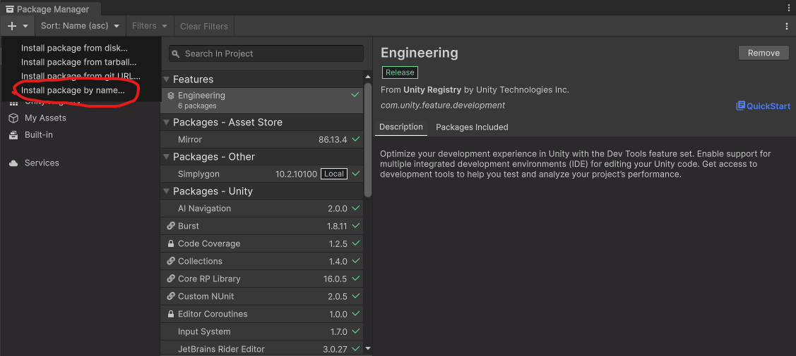

# Installing a Package in Unity by Name

This is a quick tutorial on how to install a package in Unity using its name.

## Steps to Install

1. Open your Unity project.

2. Go to the "Package Manager" window:
   - In newer versions of Unity, you can find the "Package Manager" under `Window > Package Manager`.
   - In older versions, you can find it under `Window > Package Manager`.

3. Click on the "+" button.

4. Select the option "Install package by name...".

5. Press Enter or click on the magnifying glass icon to search for the package.

6. In the "Name" field, enter the name of the library "com.unity.nuget.newtonsoft-json".

## Important Note

Make sure your Unity project is configured to use a Unity version that is compatible with the package you are installing. Some packages may require specific versions of Unity to work correctly.
